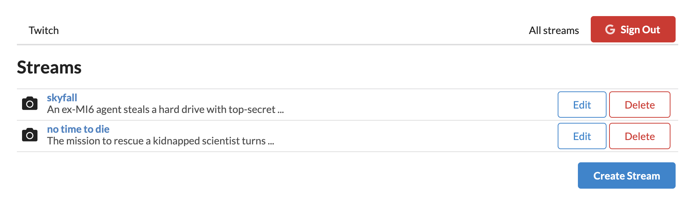

## Streamy

> Used as a reference (playground) of `redux` (CRUD) and `react-router-dom` operations.

Featuring:

- How do we navigate users around separate pages with [React Router](https://reactrouter.com/)
- Need to allow a user to login/logout with [auth0](https://auth0.com/)
- Need to handle forms in [Redux](https://react-redux.js.org/)
- Handle CRUD (Create, Read, Update, Delete) operations within Redux
- Async **actions creators** make use of `redux-thunk` middleware.

Regards,  
Luigi Lupini  
 
I ❤️ all things (🇮🇹 / 🛵 / ☕️ / 👨‍👩‍👧) 
